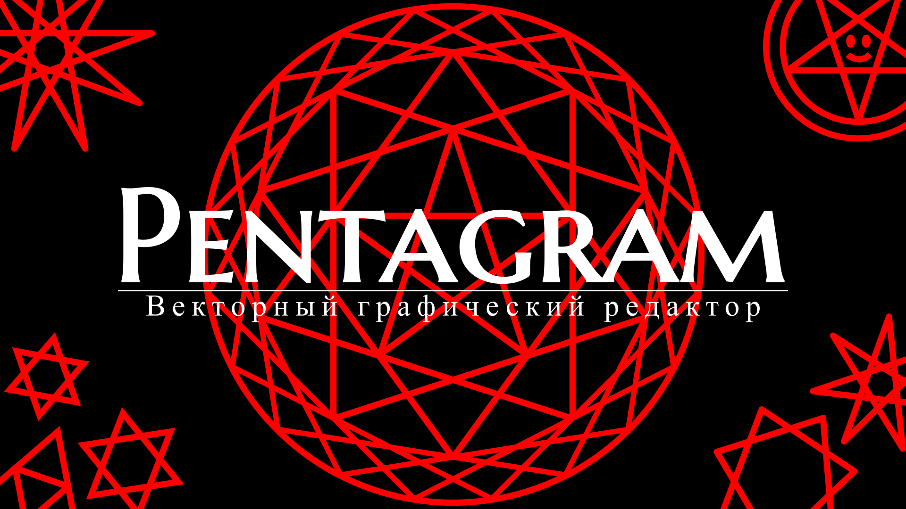

# Редактор svg-файлов

## Функционал

* Общие возможности
  * Создание svg-файла любой ширины/высоты
  * Возможность открыть и редактировать готовый svg-файл.
  * Сохранение файла в формате svg.
  * Сохранение файла в формате png.

* Инструменты
  * `Курсор` - позволяет выбирать, перетаскивать и поворачивать объекты на холсте, также позволяет изменять некоторые параметры объектов.
  * `Рука` - позволяет перемещаться по холсту, не меняя масштаб.
  * `Лупа` - позволяет масштабировать изображение.
  * `Карандаш` - рисует линию произвольной формы.
  * `Линия` - чертит прямую линию.
  * `Фигуры` - позволяет создать одну из следующих фигур:
    * `Прямоугольник` (произвольной длины, ширины).
    * `Эллипс` (с произвольными полуосями).
    * `Правильный многоугольник` (с произвольными радиусом и количеством сторон).
    * `Звёздчатый многоугольник` и `Пентаграмма` (с произвольными радиусом, количеством углов, а также с разным шагом - количеством углов, через которое "перепрыгивает" чертящая звёздчатый многоугольник линия)
  * `Текст` - создаёт прямоугольную форму, содержащую текст.
  * `Перо` - позволяет создать фигуру произвольной формы двумя разными инструментами:
    * `Произвольный многоугольник` - фигура с прямыми сторонами.
    * `Вектор` - фигура, стороны которой рисуются по принципу Кривой Безье.
     Чтобы завершить построение фигуры, зажмите `Ctrl` при постановке последней точки.
  * `Ластик` - позволяет быстро удалять объекты.
  * `Заливка` - позволяет быстро перекрашивать фигуры или задний фон.

* Параметры
  * Контур объектов может изменять свои цвет, прозрачность, ширину и тип. 
  * Заливка фигур может изменять свои цвет и прозрачность.
  * Углы всех фигур могут изменять свой тип.
  * Концы всех линий могут изменять свой тип.
  * Есть возможность работать со слоями, менять их прозрачность, очерёдность, объединять и дублировать слои.

* Дополнительные возможности
  * `Копирование`, `Вставка`, `Вырезание` и `Удаление` объектов.
  * Использование `Линеек` и `Сетки`.
  * Увеличение и уменьшение масштаба.
  * `Отмена` и `Возврат` действий.
  * Перемещение объектов `На задний план` и `На передний план` в пределах своего слоя.
  * Окно "Помощь" с подробными инструкциями

## Разработчики проекта

* Усанов Максим (капитан) - <a href=https://github.com/Mmmaximus> @mmmaximus </a>  
* Терентьева Анна - <a href=https://github.com/mathhyyn> @mathhyyn </a>
* Дельман Александр - <a href=https://github.com/xendalm> @xendalm </a>
* Шевченко Кирилл - <a href=https://github.com/shevchenkokk> @shevchenkokk </a>
* Мещанов Александр - <a href=https://github.com/Meschine> @meschine </a> 
